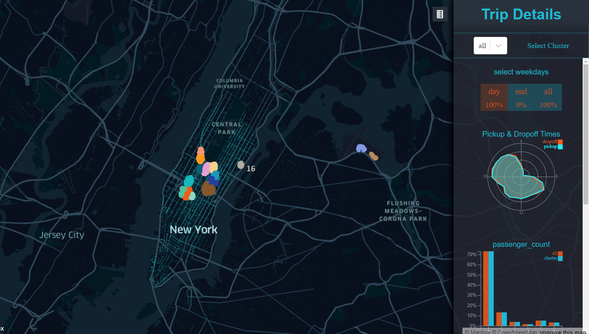

# NYC TAXI VISUALIZATION 

A visualization framework to be used on the Powerwall to visualize NYC Taxi Data.

by Julius Rauscher & Julia Klein

This project was bootstrapped with [Create React App](https://github.com/facebook/create-react-app) and [kepler.gl](https://kepler.gl/).

Taxi trip data was taken from [The New York City Taxi and Limousine Commission](https://www1.nyc.gov/site/tlc/about/tlc-trip-record-data.page).

A clustering analysis using DBSCAN was performed to identify areas with high traffic, both for weekdays and weeknights.

Points of Interests have been queried with [Google Places API](https://developers.google.com/maps/documentation/places/web-service/overview) around densely clustured areas.

## Directories

* `Data/`

    contains the scripts used for preprocessing the data.

* `Presentations/`

    contains the slides for the weekly presentations.

* `src/`

    contains the necessary files to compile the React App. 

* `build/`

    contains the optimized build. 

## Available Scripts

In the project directory, you can run:

### `npm install`

Installs the required modules to run this application. 

### `npm run start`

Runs the app in the development mode. 
Open [http://localhost:3000](http://localhost:3000) to view it in the browser.

The page will reload if you make edits. 
You will also see any lint errors in the console.

### `npm run build`

Builds the app for production to the `build` folder. 
It correctly bundles React in production mode and optimizes the build for the best performance.

The build is minified and the filenames include the hashes. 
Your app is ready to be deployed!

See the section about [deployment](https://facebook.github.io/create-react-app/docs/deployment) for more information.

### `serve -s build`

Runs the optimized build.
(Perhaps installing the serve package via `npm install serve` is necessary.) 
Open [http://localhost:5000](http://localhost:5000) to view it in the browser.

